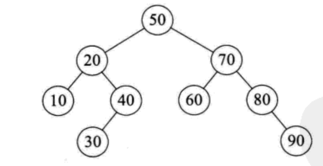
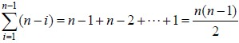
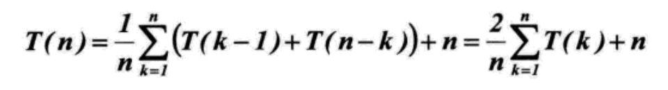

## 复杂度分析

- 时间复杂度：指执行当前算法所消耗的时间

- 空间复杂度：指执行当前算法需要占用的（临时）内存空间  
  *算法执行所需要的临时空间随着某个变量n的大小而变化*

### 一、常见的复杂度

| 大O记发 | 非正式术语 |
|:---:|:---:|
| O(1)   | 常数阶    |
| O(logn)| 对数阶    |
| O(n)   | 线性阶    |
| O(nlogn)| 线性对数阶|
| O(n<sup>2</sup>)| 平方阶 |

### 二、时间复杂度

#### 1. 常数阶O(1)
无论代码执行了多少行，只要是没有循环等复杂结构，那这个代码的时间复杂度就都是O(1)，如：
```
int i = 1;      // 执行一次
int j = 2;      // 执行一次
int m = i + j;  // 执行一次
```

#### 2. 对数阶O(logn)
```
int i = 1;      // 执行一次
while(i <= n) {   // 执行logn次
    i = i * 2;  // 执行logn次
}
```
当i>n时，循环停止。也就是说少个2相乘后其结果值会大于n，即2<sup>x</sup>=n。那么x = log<sub>2</sub>n

#### 3. 线性阶O(n)
```
for(int i = 1; i <= n; i++) {
   j = i;
   j++;
}
```
这段代码，for循环里面的代码会执行n遍，因此它消耗的时间是随着n的变化而变化的，因此这类代码都可以用O(n)来表示它的时间复杂度。

#### 4. 线性对数阶O(nlogn)
线性对数阶O(nlogN) 其实非常容易理解，将时间复杂度为O(logn)的代码循环N遍的话，那么它的时间复杂度就是 n * O(logN)，也就是了O(nlogN)。

就拿上面的代码加一点修改来举例：
```
for(int m = 1; m < n; m++) {
    int i = 1;
    while(i < n) {
        i = i * 2;
    }
}
```

#### 5. 平方阶(n<sup>2</sup>)
平方阶O(n²) 就更容易理解了，如果把 O(n) 的代码再嵌套循环一遍，它的时间复杂度就是 O(n²) 了
```
for(int x = 1; i <= n; x++) {
   for(int i = 1; i <= n; i++) {
       j = i;
       j++;
    }
}
```
这段代码其实就是嵌套了2层n循环，它的时间复杂度就是 O(n\*n)，即 O(n²) 

### 三、空间复杂度

#### 1. 常数阶O(1)

如果算法执行所需要的临时空间不随着某个变量n的大小而变化，即此算法空间复杂度为一个常量，可表示为 O(1)
```
int i = 1;
int j = 2;
int m = i + j;
```
代码中的 i、j、m 所分配的空间都不随着处理数据量变化，因此它的空间复杂度为O(1)

#### 2. 线性阶O(n)
```
int[] m = new int[n]
for(int i = 1; i <= n; i++) {
   j = i;
   j++;
}
```
这段代码中，第一行new了一个数组出来，这个数据占用的大小为n，这段代码的其他行，虽然有循环，但没有再分配新的**与某个变量大小而变化的**空间，因此，这段代码的空间复杂度主要看第一行即可，即O(n)

### 四、递归的复杂度分析

分析在递归代码的（时间和空间）复杂度，需要借助递归树/递归栈来理解

以快排为例。快排的性能取决于其递归的深度，可以用递归树来描述递归算法的执行情况。如图所示，它是{50,10,90,30, 70,40,80,60,20}在快速排序过程中的递归过程。由于我们的第一个关键字是50，正好是待排序的序列的中间值，因此递归树是平衡的，此时性能也比较好。



在最优情况下，Partition每次都划分得很均匀，如果排序n个关键字，其递归树的深度就为.log<sub>2</sub>n.+1（.x.表示不大于x的最大整数），即仅需递归log<sub>2</sub>n次，需要时间为T（n）的话，第一次Partiation应该是需要对整个数组扫描一遍，做n次比较。然后，获得的枢轴将数组一分为二，那么各自还需要T（n/2）的时间（注意是最好情况，所以平分两半）。于是不断地划分下去，我们就有了下面的不等式推断。

```
T（n）≤2T（n/2） +n，T（1）=0  
T（n）≤2（2T（n/4）+n/2） +n=4T（n/4）+2n  
T（n）≤4（2T（n/8）+n/4） +2n=8T（n/8）+3n  
……  
T（n）≤nT（1）+（log2n）×n= O(nlogn) 
```

也就是说，在最优的情况下，快速排序算法的时间复杂度为O(nlogn)。  
在最坏的情况下，待排序的序列为正序或者逆序，每次划分只得到一个比上一次划分少一个记录的子序列，注意另一个为空。如果递归树画出来，它就是一棵斜树。此时需要执行n‐1次递归调用，且第i次划分需要经过n‐i次关键字的比较才能找到第i个记录，也就是枢轴的位置，因此比较次数为



最终其时间复杂度为O(n2)。

平均的情况，设枢轴的关键字应该在第k的位置（1≤k≤n），那么：



由数学归纳法可证明，其数量级为O(nlogn)。

就空间复杂度来说，主要是递归造成的栈空间的使用，最好情况，递归树的深度为log<sub>2</sub>n下取整+1，其空间复杂度也就为O(logn)，最坏情况，需要进行n‐1递归调用，其空间复杂度为O(n)，平均情况，空间复杂度也为O(logn)。

```
\*快速排序*\
void _quickSort(vector<int> &a, int low, int high) {
    if (low >= high)    return;

    int mid = partition(a, low, high);  // 切分
    _quickSort(a, low, mid - 1);        // 将左半部分排序
    _quickSort(a, mid + 1, high);       // 将右半部分排序
}

int partition(vector<int> &a, int low, int high) {          // 时间复杂度为O(high-low)
    int key = a[low];
    while (low < high) {
        while (low < high && a[high] >= key)    high--;     // 注意是key <= a[high]，而不是key < a[high]，否则陷入死循环
        a[low] = a[high];                                   // 因为左和右分别是`不大于`与`不小于`key的数
        while (low < high && a[low] <= key)     low++;
        a[high] = a[low];
    }

    a[low] = key;
    return low;
}
```

### Reference
> [*算法的时间与空间复杂度（一看就懂*）](https://zhuanlan.zhihu.com/p/50479555)
> 
> [*快速排序最好，最坏，平均复杂度分析*](https://blog.csdn.net/weshjiness/article/details/8660583)
