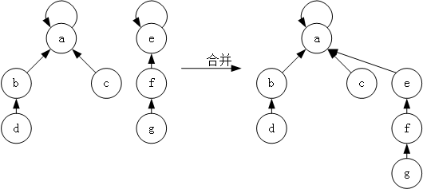

## 并查集
### 1 概述
 - 并查集是一种树型的数据结构，用于处理一些**不相交集合**的合并及查询问题。
 - 通常使用森林来表示并查集，其中每一棵树是一个集合；树的每个节点就表示集合中的一个元素，树根对应的元素就是该集合的代表。
 - 并查集支持的3个基本操作：
   - 建立并查集
   - 合并两个集合
   - 查找一个元素所在的集合

### 2 并查集的实现
 - 树节点 **unionFindNode**
```C++
struct unionFindNode {
    int parent;         // 节点的父节点指针
    bool is_root;       // 节点是否是根节点，是为true
    unionFindNode(){
        parent = -1;    // 另根结点的父节点为-1，即不存在
        is_root = true; // 初始化时每个集合中都只有一个节点，因此每个节点都为根节点
    }
};
```
 - **unionFind(int num_node)**：构造函数，建立并查集
   - 初始化每一个节点都是一个集合<br />
   
   - 时间复杂度为：O(n)，n为节点的个数
 
 - **int find(int element)**：查找结点element的集合id，返回集合id
   - 沿着父节点向上查找，找到的根节点就为该集合的id
   - 时间复杂度为：O(h)，h为树的高度

 - **void unite(int class1, int class2)**：将两个集合id所代表的集合合并
   - 让一个集合的树根指向另一个集合的树根，即让一棵树成为另一棵树的子树<br />
   
   - 时间复杂度为O(1)

### 3 并查集的优化
 - 查找优化：路径压缩
   - 在每次查找时，令查找路径上的每个节点的parent指针都直接指向根节点。
   - 虽然路径压缩增加了单个查找操作的时间，但它减少了此后查找操作的时间。<br>
 
 - 合并优化：启发式优化
   - 重量规则：若根为i的树的节点数少于根为j的树的节点数，则将j作为i的父节点。否则，将i作为j的父节点。<br/>使用重量规则构建一棵具有s个结点的树t，则树t的高度最多为log<sub>2</sub>p+1下取整。.
   - 高度规则：若根为i的树的高度小于根为j的树的高度，则将j作为i的父节点，否则，将i作为j的父节点。
 - 由于进行路径压缩的过程改变了树的高度，使得路径压缩和高度规则难以结合；而路径压缩的过程并没有改变树的重量，因此让路径压缩方法和重量规则一起使用相对比较容易。

### 4 代码实现
 - [并查集](./unionFind.h)
 - [优化的并查集](./optimizeUnionFind.h)：路径压缩 + 重量规则

### 5 应用
 - [最小生成树的Kruskal算法]()


## 并查集
### 1 概述
 - 并查集是一种树型的数据结构，用于处理一些**不相交集合**的合并及查询问题。
 - 通常使用森林来表示并查集，其中每一棵树是一个集合；树的每个节点就表示集合中的一个元素，树根对应的元素就是该集合的代表。
 - 并查集支持的3个基本操作：
   - 建立并查集（初始化后每一个元素的父亲节点是它本身）
   - 查找一个元素所在的集合
   - 合并两个集合

### 2 优化
- 路径压缩
   - 在查询的过程中，把沿途的每个节点的父节点都设为根节点即可。下一次再查询时，我们就可以省很多事。
- 按秩合并
   - 高度小的作为高度大的子树

### 3 实现
```
#define MAX 100

int father[MAX];    // father[x]表示x的父节点
int rank[MAX];      // rank[x]表示以x为根节点的树的高度（从1开始）

/* 初始化集合，n表示节点个数，从1开始 */
void intiFindUnion(int n)
{
    for (int i = 0; i < n; i++)
    {
        father[i] = i;
        rank[i] = 1;
    }
}

int find(int i)
{
    if (father[i] == i)
    {
        return i;
    }
    else
    {
        father[i] = find(father[i]);    // 把沿途的每个节点的父节点都设为根节点
        return father[i];               // 返回父节点
    }
}

void union(int i, int j)
{
    //先找到两个根节点
    i = find(i);
    j = find(j);

    // 如果根节点相同同，直接返回
    if (i == j)
    {
        return;
    }

    // 高度小的作为高度大的子树
    if (rank[i] < rank[j])
    {
        father[i] = j;
    }
    else if (rank[i] > rank[j])
    {
        father[j] = i;
    }
    // 如果深度相同，则新的根节点的深度+1
    else
    {
        father[i] = j;
        rank[j]++;
    }
}


```

> *Reference*  
> [*算法学习笔记(1) : 并查集*](https://zhuanlan.zhihu.com/p/93647900)  
> [*并查集入门*](https://www.cnblogs.com/PegasusWang/archive/2013/04/20/3031819.html)
