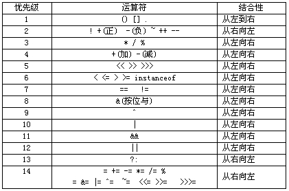

## 位操作

### 优先级

括号 > 成员访问 > 单元运算符 > 乘除 > 加减 > 移位 > 关系运算 > 位运算 > 逻辑运算 > 赋值

位运算（& > ^ > |）  
逻辑运算（&& > ||）




### 二进制表示

正常：常规的二进制表示。
负数：绝对值的二进制补码表示（补码即为反码+1）

### 移位运算

- 左移：高位丢弃，低位补零
- 右移：无符号位，高位补零，低位丢弃；有符号位，高位补符号位，低位丢弃

### 常见的位运算

1. 位操作实现乘除法
（正负）数 a 向右移一位，相当于将 a 除以 2；数 a 向左移一位，相当于将 a 乘以 2
```
int a = 2;
a >> 1; ---> 1
a << 1; ---> 4
```

2. 位操作判断奇偶数
只要根据数的最后一位是 0 还是 1 来决定即可，为 0 就是偶数，为 1 就是奇数。
```
if((a & 1) == 0) {
    //偶数
}
```

3. 位操作进行高低位交换
```
unsigned short a = 34520;
a = (a >> 8) | (a << 8);
```

4. 位操作统计二进制中 1 的个数
```
int count = 0;
while (a != 0)
{
    a &= (a - 1);   // 每计算一次二进制中就消去最后一个位 1
    count++;
}
```

5. 取最值
```
const int MAX = ~(1 << (sizeof(int)-1));
const int MIN = -MAX - 1;
```

### 位运算实现加减乘除

- [加法]()
- [减法]()
- [乘法]()
- [除法]()
