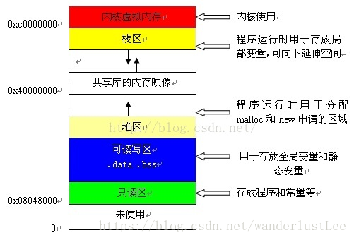

### 内存

#### 堆和栈
根据最下方的图片 --> 申请/回收方式、大小、存储内容、增长方式

1. 申请/回收方式

  - 栈：自动分配空间和回收
  - 堆：手动申请空间和释放

2. 效率

  - 栈：由系统自动分配，速度较快。但程序员是无法控制的。
  - 堆：是由new分配的内存，一般速度比较慢，而且容易产生内存碎片，不过用起来最方便。

3. 大小

  - 栈：小，一块连续的内存的区域
  - 堆：大

4. 存储内容

  - 栈：函数地址、函数参数、局部变量
  - 堆：new 的空间

5. 地址增长方式

  - 栈：向着内存地址减小的方向增长
  - 堆：堆是向着内存地址增加的方向增长的

